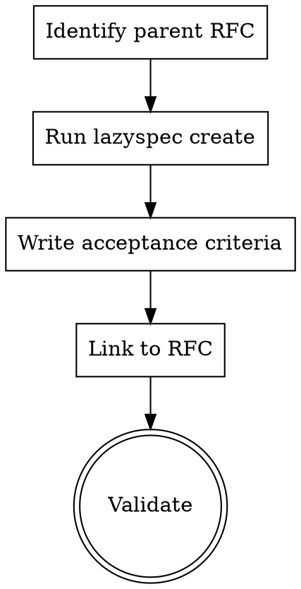
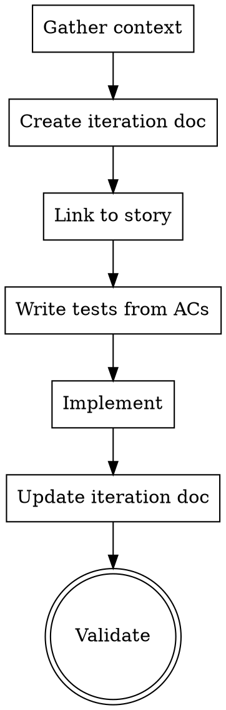
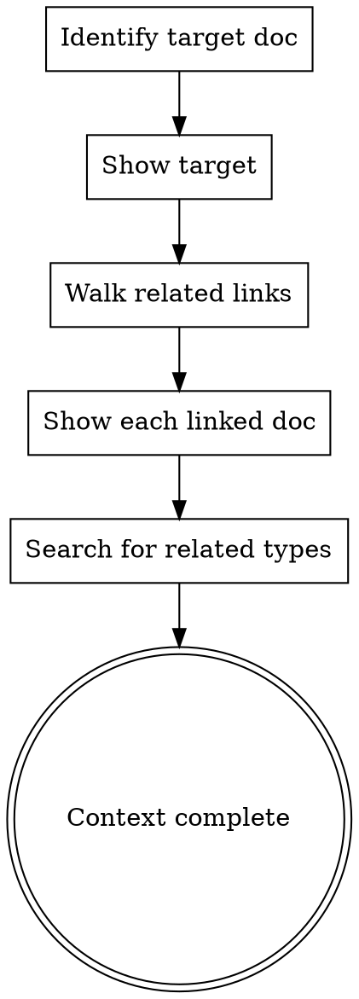
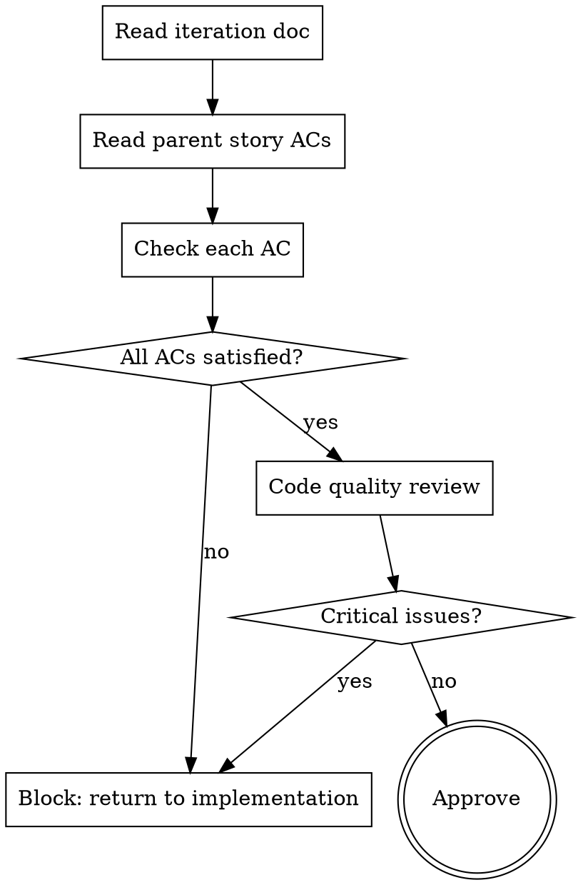
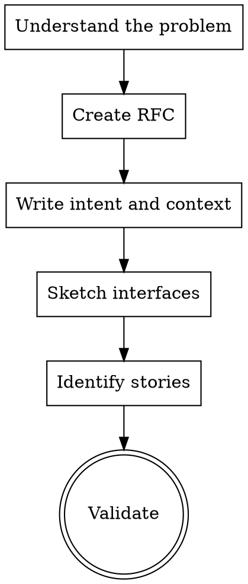

# AI-Driven Workflow Implementation Plan

> **For Claude:** REQUIRED SUB-SKILL: Use superpowers:executing-plans to implement this plan task-by-task.

**Goal:** Replace SPEC/PLAN document types with STORY/ITERATION, add search command, make validation strict, and create Superpowers skill files.

**Architecture:** Rename existing enum variants and config fields throughout the codebase. Add a `search` method to Store and a `search` CLI subcommand. Expand `ValidationError` with new variants for relational integrity. Skills are standalone markdown files.

**Tech Stack:** Rust, clap, serde, ratatui (existing stack)

---

### Task 1: Rename DocType::Spec to DocType::Story and DocType::Plan to DocType::Iteration

**Files:**
- Modify: `src/engine/document.rs:7-25`

**Step 1: Update the DocType enum and Display impl**

Replace the enum variants and their display strings:

```rust
#[derive(Debug, Clone, PartialEq, Eq, Deserialize)]
#[serde(rename_all = "lowercase")]
pub enum DocType {
    Rfc,
    Adr,
    Story,
    Iteration,
}

impl fmt::Display for DocType {
    fn fmt(&self, f: &mut fmt::Formatter<'_>) -> fmt::Result {
        match self {
            DocType::Rfc => write!(f, "RFC"),
            DocType::Adr => write!(f, "ADR"),
            DocType::Story => write!(f, "STORY"),
            DocType::Iteration => write!(f, "ITERATION"),
        }
    }
}
```

**Step 2: Run tests to see what breaks**

Run: `cargo test 2>&1 | head -60`
Expected: Compilation errors in files still referencing `DocType::Spec` and `DocType::Plan`

---

### Task 2: Update Config to use stories/iterations directories

**Files:**
- Modify: `src/engine/config.rs:14-17,30-37`

**Step 1: Rename fields in Directories struct and defaults**

```rust
#[derive(Debug, Clone, Serialize, Deserialize)]
pub struct Directories {
    pub rfcs: String,
    pub adrs: String,
    pub stories: String,
    pub iterations: String,
}

// In Default impl:
impl Default for Config {
    fn default() -> Self {
        Config {
            directories: Directories {
                rfcs: "docs/rfcs".to_string(),
                adrs: "docs/adrs".to_string(),
                stories: "docs/stories".to_string(),
                iterations: "docs/iterations".to_string(),
            },
            templates: Templates {
                dir: ".lazyspec/templates".to_string(),
            },
            naming: Naming {
                pattern: "{type}-{n:03}-{title}.md".to_string(),
            },
        }
    }
}
```

**Step 2: Run tests to see remaining compilation errors**

Run: `cargo test 2>&1 | head -60`
Expected: More compilation errors in store.rs, init.rs, etc. that reference `config.directories.specs` / `config.directories.plans`

---

### Task 3: Update Store to use new directory and type names

**Files:**
- Modify: `src/engine/store.rs:26-31`

**Step 1: Update directory references in Store::load**

Change the `dirs` array:

```rust
let dirs = [
    &config.directories.rfcs,
    &config.directories.adrs,
    &config.directories.stories,
    &config.directories.iterations,
];
```

**Step 2: Run tests to check remaining compilation errors**

Run: `cargo test 2>&1 | head -60`

---

### Task 4: Update CLI commands for new type names

**Files:**
- Modify: `src/cli/mod.rs:24-27,37-39`
- Modify: `src/cli/create.rs:15-20`
- Modify: `src/cli/list.rs:6-11`
- Modify: `src/cli/init.rs:14-17`

**Step 1: Update CLI help text in mod.rs**

Change the doc comments on the `Create` and `List` variants:

```rust
Create {
    /// Document type (rfc, adr, story, iteration)
    #[arg()]
    doc_type: String,
    // ... rest unchanged
},
List {
    /// Filter by type (rfc, adr, story, iteration)
    #[arg()]
    doc_type: Option<String>,
    // ... rest unchanged
},
```

**Step 2: Update create.rs type matching**

```rust
let dir = match doc_type.to_lowercase().as_str() {
    "rfc" => &config.directories.rfcs,
    "adr" => &config.directories.adrs,
    "story" => &config.directories.stories,
    "iteration" => &config.directories.iterations,
    _ => return Err(anyhow!("unknown doc type: {}", doc_type)),
};
```

**Step 3: Update list.rs type matching**

```rust
doc_type: doc_type.and_then(|t| match t.to_lowercase().as_str() {
    "rfc" => Some(DocType::Rfc),
    "adr" => Some(DocType::Adr),
    "story" => Some(DocType::Story),
    "iteration" => Some(DocType::Iteration),
    _ => None,
}),
```

**Step 4: Update init.rs directory creation**

```rust
fs::create_dir_all(root.join(&config.directories.rfcs))?;
fs::create_dir_all(root.join(&config.directories.adrs))?;
fs::create_dir_all(root.join(&config.directories.stories))?;
fs::create_dir_all(root.join(&config.directories.iterations))?;
fs::create_dir_all(root.join(&config.templates.dir))?;
```

**Step 5: Run tests to check compilation**

Run: `cargo test 2>&1 | head -60`

---

### Task 5: Update TUI for new type names

**Files:**
- Modify: `src/tui/app.rs:33`

**Step 1: Update doc_types vector in App::new**

```rust
doc_types: vec![DocType::Rfc, DocType::Adr, DocType::Story, DocType::Iteration],
```

**Step 2: Run compilation check**

Run: `cargo build 2>&1 | head -30`
Expected: Clean compilation (all source references now updated)

---

### Task 6: Update all existing tests for new type names

**Files:**
- Modify: `tests/document_test.rs`
- Modify: `tests/config_test.rs`
- Modify: `tests/store_test.rs`
- Modify: `tests/cli_init_test.rs`
- Modify: `tests/cli_create_test.rs`
- Modify: `tests/cli_query_test.rs`

**Step 1: Update document_test.rs**

In `extract_body_skips_frontmatter`, change `type: spec` to `type: story`.

**Step 2: Update config_test.rs**

In `parse_config_from_toml`:
```toml
stories = "docs/stories"
iterations = "docs/iterations"
```

In assertions:
```rust
assert_eq!(config.directories.stories, "docs/stories");
// remove specs/plans assertions, add stories/iterations
```

In `default_config`:
```rust
assert_eq!(config.directories.stories, "docs/stories");
assert_eq!(config.directories.iterations, "docs/iterations");
// remove specs/plans assertions
```

**Step 3: Update store_test.rs**

In `setup_test_dir`, change:
```rust
fs::create_dir_all(root.join("docs/stories")).unwrap();
fs::create_dir_all(root.join("docs/iterations")).unwrap();
```
(Remove the `docs/specs` and `docs/plans` directory creation.)

**Step 4: Update cli_init_test.rs**

Change assertions:
```rust
assert!(root.join("docs/stories").is_dir());
assert!(root.join("docs/iterations").is_dir());
// remove specs/plans assertions
```

**Step 5: Update cli_create_test.rs**

In `create_uses_default_template_when_custom_missing`:
- Change `docs/specs` to `docs/stories`
- Change `"spec"` to `"story"` in the `run` call
- Change assertion from `"type: spec"` to `"type: story"`

**Step 6: Run all tests**

Run: `cargo test`
Expected: All existing tests pass

**Step 7: Commit**

```
feat: rename Spec/Plan to Story/Iteration

Breaking change: documents using type: spec or type: plan
will no longer parse. Use type: story and type: iteration.
Config directories renamed from specs/plans to
stories/iterations.
```

---

### Task 7: Add Story and Iteration default templates

**Files:**
- Modify: `src/cli/create.rs:53-70`

**Step 1: Write failing test**

Add to `tests/cli_create_test.rs`:

```rust
#[test]
fn create_story_uses_default_template_with_ac_sections() {
    let dir = TempDir::new().unwrap();
    let root = dir.path();
    fs::create_dir_all(root.join("docs/stories")).unwrap();

    let config = Config::default();
    let path = lazyspec::cli::create::run(root, &config, "story", "User Auth", "jkaloger").unwrap();

    let content = fs::read_to_string(&path).unwrap();
    assert!(content.contains("type: story"));
    assert!(content.contains("## Acceptance Criteria"));
    assert!(content.contains("**Given**"));
    assert!(content.contains("**When**"));
    assert!(content.contains("**Then**"));
    assert!(content.contains("## Scope"));
}

#[test]
fn create_iteration_uses_default_template() {
    let dir = TempDir::new().unwrap();
    let root = dir.path();
    fs::create_dir_all(root.join("docs/iterations")).unwrap();

    let config = Config::default();
    let path = lazyspec::cli::create::run(root, &config, "iteration", "Auth Impl 1", "agent").unwrap();

    let content = fs::read_to_string(&path).unwrap();
    assert!(content.contains("type: iteration"));
    assert!(content.contains("## Changes"));
    assert!(content.contains("## Test Plan"));
}
```

**Step 2: Run tests to verify they fail**

Run: `cargo test create_story_uses_default -- --nocapture 2>&1 | tail -10`
Expected: FAIL (default_template produces generic template without AC sections)

**Step 3: Update default_template in create.rs**

Replace the `default_template` function:

```rust
fn default_template(doc_type: &str) -> String {
    match doc_type.to_lowercase().as_str() {
        "story" => r#"---
title: "{title}"
type: story
status: draft
author: "{author}"
date: {date}
tags: []
related: []
---

## Context

## Acceptance Criteria

### AC1: <criteria name>

**Given** <precondition>
**When** <action>
**Then** <expected outcome>

## Scope

### In Scope
-

### Out of Scope
-
"#.to_string(),
        "iteration" => r#"---
title: "{title}"
type: iteration
status: draft
author: "{author}"
date: {date}
tags: []
related: []
---

## Changes

## Test Plan

## Notes
"#.to_string(),
        _ => format!(
            r#"---
title: "{{title}}"
type: {}
status: draft
author: "{{author}}"
date: {{date}}
tags: []
---

## Summary

TODO
"#,
            doc_type.to_lowercase()
        ),
    }
}
```

**Step 4: Run tests**

Run: `cargo test create_story create_iteration`
Expected: PASS

**Step 5: Commit**

```
feat: add Story and Iteration default templates

Story template includes given/when/then AC sections and
scope boundaries. Iteration template includes changes,
test plan, and notes sections.
```

---

### Task 8: Add search method to Store

**Files:**
- Modify: `src/engine/store.rs`

**Step 1: Write failing test**

Add to `tests/store_test.rs`:

```rust
#[test]
fn store_search_matches_title() {
    let dir = setup_test_dir();
    let config = Config::default();
    let store = Store::load(dir.path(), &config).unwrap();

    let results = store.search("Event");
    assert_eq!(results.len(), 1);
    assert_eq!(results[0].doc.title, "Event Sourcing");
}

#[test]
fn store_search_matches_body() {
    let dir = setup_test_dir();
    let config = Config::default();
    let store = Store::load(dir.path(), &config).unwrap();

    let results = store.search("proposal");
    assert_eq!(results.len(), 1);
    assert_eq!(results[0].doc.title, "Event Sourcing");
}

#[test]
fn store_search_matches_tags() {
    let dir = setup_test_dir();
    let config = Config::default();
    let store = Store::load(dir.path(), &config).unwrap();

    let results = store.search("events");
    assert_eq!(results.len(), 1);
    assert_eq!(results[0].doc.title, "Adopt Event Sourcing");
}

#[test]
fn store_search_is_case_insensitive() {
    let dir = setup_test_dir();
    let config = Config::default();
    let store = Store::load(dir.path(), &config).unwrap();

    let results = store.search("event sourcing");
    assert!(!results.is_empty());
}

#[test]
fn store_search_no_results() {
    let dir = setup_test_dir();
    let config = Config::default();
    let store = Store::load(dir.path(), &config).unwrap();

    let results = store.search("nonexistent_xyz");
    assert!(results.is_empty());
}
```

**Step 2: Run tests to verify they fail**

Run: `cargo test store_search 2>&1 | tail -10`
Expected: FAIL (method `search` not found)

**Step 3: Add SearchResult struct and search method to store.rs**

Add after the `ValidationError` impl block:

```rust
#[derive(Debug)]
pub struct SearchResult<'a> {
    pub doc: &'a DocMeta,
    pub match_field: &'static str,
    pub snippet: String,
}
```

Add method to `impl Store`:

```rust
pub fn search(&self, query: &str) -> Vec<SearchResult> {
    let query_lower = query.to_lowercase();
    let mut results = Vec::new();

    for (_path, meta) in &self.docs {
        if meta.title.to_lowercase().contains(&query_lower) {
            results.push(SearchResult {
                doc: meta,
                match_field: "title",
                snippet: meta.title.clone(),
            });
            continue;
        }

        if meta.tags.iter().any(|t| t.to_lowercase().contains(&query_lower)) {
            let matched_tag = meta.tags.iter()
                .find(|t| t.to_lowercase().contains(&query_lower))
                .unwrap();
            results.push(SearchResult {
                doc: meta,
                match_field: "tag",
                snippet: matched_tag.clone(),
            });
            continue;
        }

        if let Ok(body) = self.get_body(&meta.path) {
            let body_lower = body.to_lowercase();
            if let Some(pos) = body_lower.find(&query_lower) {
                let start = pos.saturating_sub(40);
                let end = (pos + query.len() + 40).min(body.len());
                let snippet = body[start..end].to_string();
                results.push(SearchResult {
                    doc: meta,
                    match_field: "body",
                    snippet,
                });
            }
        }
    }

    results.sort_by(|a, b| a.doc.path.cmp(&b.doc.path));
    results
}
```

**Step 4: Run tests**

Run: `cargo test store_search`
Expected: PASS

**Step 5: Commit**

```
feat: add search method to Store

Searches across document titles, tags, and body content
with case-insensitive substring matching. Returns results
with match field and context snippet.
```

---

### Task 9: Add search CLI subcommand

**Files:**
- Create: `src/cli/search.rs`
- Modify: `src/cli/mod.rs`
- Modify: `src/main.rs`

**Step 1: Add Search variant to CLI commands in mod.rs**

Add to the `Commands` enum:

```rust
/// Search across all documents
Search {
    /// Search query
    #[arg()]
    query: String,
    /// Filter by type (rfc, adr, story, iteration)
    #[arg(long, name = "type")]
    doc_type: Option<String>,
    /// Output as JSON
    #[arg(long)]
    json: bool,
},
```

Add `pub mod search;` to the module declarations at the top.

**Step 2: Create src/cli/search.rs**

```rust
use crate::engine::document::DocType;
use crate::engine::store::Store;

pub fn run(store: &Store, query: &str, doc_type: Option<&str>, json: bool) {
    let mut results = store.search(query);

    if let Some(dt) = doc_type {
        let filter_type = match dt.to_lowercase().as_str() {
            "rfc" => Some(DocType::Rfc),
            "adr" => Some(DocType::Adr),
            "story" => Some(DocType::Story),
            "iteration" => Some(DocType::Iteration),
            _ => None,
        };
        if let Some(ft) = filter_type {
            results.retain(|r| r.doc.doc_type == ft);
        }
    }

    if json {
        let items: Vec<_> = results
            .iter()
            .map(|r| {
                serde_json::json!({
                    "path": r.doc.path.to_string_lossy(),
                    "title": r.doc.title,
                    "type": format!("{}", r.doc.doc_type),
                    "status": format!("{}", r.doc.status),
                    "match_field": r.match_field,
                    "snippet": r.snippet,
                })
            })
            .collect();
        println!("{}", serde_json::to_string_pretty(&items).unwrap());
    } else {
        if results.is_empty() {
            println!("No results for \"{}\"", query);
            return;
        }
        for r in &results {
            println!(
                "{:<40} {:<10} {:<12} [{}]",
                r.doc.title,
                r.doc.doc_type,
                r.doc.status,
                r.match_field,
            );
            println!("  {}", r.doc.path.display());
            println!("  ...{}...", r.snippet.trim());
            println!();
        }
    }
}
```

**Step 3: Wire up in main.rs**

Add this match arm after the `Validate` arm:

```rust
Some(Commands::Search { query, doc_type, json }) => {
    let cwd = std::env::current_dir()?;
    let config = Config::load(&cwd)?;
    let store = Store::load(&cwd, &config)?;
    lazyspec::cli::search::run(&store, &query, doc_type.as_deref(), json);
}
```

**Step 4: Run build check**

Run: `cargo build`
Expected: Clean compilation

**Step 5: Commit**

```
feat: add search CLI subcommand

lazyspec search <query> [--type <type>] [--json]
Searches across titles, tags, and body content.
```

---

### Task 10: Expand validation with strict relational checks

**Files:**
- Modify: `src/engine/store.rs:185-220`
- Modify: `src/engine/document.rs` (needs DocType on DocMeta to be checkable)

**Step 1: Write failing tests**

Add to `tests/cli_validate_test.rs`:

```rust
#[test]
fn validate_catches_unlinked_iteration() {
    let dir = TempDir::new().unwrap();
    let root = dir.path();

    fs::create_dir_all(root.join("docs/iterations")).unwrap();
    fs::write(
        root.join("docs/iterations/ITERATION-001.md"),
        "---\ntitle: \"Orphan Iteration\"\ntype: iteration\nstatus: draft\nauthor: a\ndate: 2026-01-01\ntags: []\n---\n",
    ).unwrap();

    let config = Config::default();
    let store = Store::load(root, &config).unwrap();
    let errors = store.validate();

    assert!(!errors.is_empty());
    let has_unlinked = errors.iter().any(|e| matches!(e, lazyspec::engine::store::ValidationError::UnlinkedIteration { .. }));
    assert!(has_unlinked);
}

#[test]
fn validate_catches_unlinked_adr() {
    let dir = TempDir::new().unwrap();
    let root = dir.path();

    fs::create_dir_all(root.join("docs/adrs")).unwrap();
    fs::write(
        root.join("docs/adrs/ADR-001.md"),
        "---\ntitle: \"Orphan ADR\"\ntype: adr\nstatus: draft\nauthor: a\ndate: 2026-01-01\ntags: []\n---\n",
    ).unwrap();

    let config = Config::default();
    let store = Store::load(root, &config).unwrap();
    let errors = store.validate();

    assert!(!errors.is_empty());
    let has_unlinked = errors.iter().any(|e| matches!(e, lazyspec::engine::store::ValidationError::UnlinkedAdr { .. }));
    assert!(has_unlinked);
}

#[test]
fn validate_passes_linked_iteration() {
    let dir = TempDir::new().unwrap();
    let root = dir.path();

    fs::create_dir_all(root.join("docs/stories")).unwrap();
    fs::create_dir_all(root.join("docs/iterations")).unwrap();

    fs::write(
        root.join("docs/stories/STORY-001.md"),
        "---\ntitle: \"A Story\"\ntype: story\nstatus: draft\nauthor: a\ndate: 2026-01-01\ntags: []\n---\n",
    ).unwrap();

    fs::write(
        root.join("docs/iterations/ITERATION-001.md"),
        "---\ntitle: \"Impl\"\ntype: iteration\nstatus: draft\nauthor: a\ndate: 2026-01-01\ntags: []\nrelated:\n  - implements: docs/stories/STORY-001.md\n---\n",
    ).unwrap();

    let config = Config::default();
    let store = Store::load(root, &config).unwrap();
    let errors = store.validate();

    assert!(errors.is_empty());
}
```

**Step 2: Run tests to verify they fail**

Run: `cargo test validate_catches_unlinked 2>&1 | tail -10`
Expected: FAIL (UnlinkedIteration variant doesn't exist)

**Step 3: Expand ValidationError enum and validate method**

Update `ValidationError` in `src/engine/store.rs`:

```rust
#[derive(Debug)]
pub enum ValidationError {
    BrokenLink { source: PathBuf, target: PathBuf },
    UnlinkedIteration { path: PathBuf },
    UnlinkedAdr { path: PathBuf },
}

impl std::fmt::Display for ValidationError {
    fn fmt(&self, f: &mut std::fmt::Formatter<'_>) -> std::fmt::Result {
        match self {
            ValidationError::BrokenLink { source, target } => {
                write!(f, "broken link: {} -> {}", source.display(), target.display())
            }
            ValidationError::UnlinkedIteration { path } => {
                write!(f, "iteration without story link: {}", path.display())
            }
            ValidationError::UnlinkedAdr { path } => {
                write!(f, "ADR without any relation: {}", path.display())
            }
        }
    }
}
```

Update the `validate` method:

```rust
pub fn validate(&self) -> Vec<ValidationError> {
    let mut errors = Vec::new();

    for (path, meta) in &self.docs {
        // Check broken links
        for rel in &meta.related {
            let target = PathBuf::from(&rel.target);
            if !self.docs.contains_key(&target) {
                errors.push(ValidationError::BrokenLink {
                    source: path.clone(),
                    target,
                });
            }
        }

        // Iterations must link to a story via implements
        if meta.doc_type == DocType::Iteration {
            let has_story_link = meta.related.iter().any(|r| {
                r.rel_type == RelationType::Implements
                    && self.docs.get(&PathBuf::from(&r.target))
                        .map(|d| d.doc_type == DocType::Story)
                        .unwrap_or(false)
            });
            if !has_story_link {
                errors.push(ValidationError::UnlinkedIteration {
                    path: path.clone(),
                });
            }
        }

        // ADRs must have at least one relation
        if meta.doc_type == DocType::Adr && meta.related.is_empty() {
            errors.push(ValidationError::UnlinkedAdr {
                path: path.clone(),
            });
        }
    }

    errors
}
```

Note: This requires adding `use crate::engine::document::{DocMeta, DocType, RelationType, Status};` to store.rs imports (DocType and RelationType are already imported).

**Step 4: Run tests**

Run: `cargo test validate`
Expected: PASS

**Step 5: Commit**

```
feat: strict validation for iterations and ADRs

Iterations must have an implements relation to a story.
ADRs must have at least one relation. Validation is
always strict.
```

---

### Task 11: Update .lazyspec.toml config file

**Files:**
- Modify: `.lazyspec.toml`

**Step 1: Update directory names**

```toml
[directories]
rfcs = "docs/rfcs"
adrs = "docs/adrs"
stories = "docs/stories"
iterations = "docs/iterations"

[templates]
dir = ".lazyspec/templates"

[naming]
pattern = "{type}-{n:03}-{title}.md"
```

**Step 2: Rename directories on disk**

Run: `mv docs/specs docs/stories && mv docs/plans docs/iterations`
(Only if these directories exist and contain content worth preserving.)

**Step 3: Run full test suite**

Run: `cargo test`
Expected: All tests pass

**Step 4: Commit**

```
chore: update config and directories for story/iteration rename
```

---

### Task 12: Create Superpowers skill files

**Files:**
- Create: `skills/create-story.md`
- Create: `skills/create-iteration.md`
- Create: `skills/resolve-context.md`
- Create: `skills/review-iteration.md`
- Create: `skills/write-rfc.md`

**Step 1: Create skills directory**

Run: `mkdir -p skills`

**Step 2: Create skills/create-story.md**

```markdown
---
name: create-story
description: Use when starting a new feature, card, or vertical slice of work. Creates a Story document with given/when/then acceptance criteria linked to an RFC.
---

# Create Story

## Workflow



## Steps

1. **Find the parent RFC:** Run `lazyspec list rfc` to find the relevant RFC. Use `lazyspec show <id>` to verify it's the right one.

2. **Create the story:** Run `lazyspec create story "<title>" --author <name>`

3. **Write acceptance criteria:** Edit the created file. Each AC must follow given/when/then:
   - **Given** a precondition that establishes context
   - **When** an action is taken
   - **Then** an observable outcome occurs

4. **Link to RFC:** Run `lazyspec link <story-path> implements <rfc-path>`

5. **Define scope:** Fill in the In Scope and Out of Scope sections. Be explicit about what this story does NOT cover.

6. **Validate:** Run `lazyspec validate` to ensure all links resolve.

## Rules

- A Story must be readable by a client without referencing implementation details
- If you can't write the Story without mentioning implementation specifics, it's scoped wrong
- Each AC must be independently testable
- Keep stories small enough to complete in 1-3 iterations
```

**Step 3: Create skills/create-iteration.md**

```markdown
---
name: create-iteration
description: Use when implementing against a Story. Creates an Iteration document, links it to the Story, and drives TDD — tests written against Story ACs before implementation.
---

# Create Iteration

## Workflow



## Steps

1. **Gather context:** Run `lazyspec show <story-id>` to read the Story and its ACs. Check existing iterations: `lazyspec list iteration`.

2. **Create the iteration:** Run `lazyspec create iteration "<title>" --author agent`

3. **Link to story:** Run `lazyspec link <iteration-path> implements <story-path>`

4. **Write tests first:** For each AC this iteration covers, write a failing test before any implementation code. Document the test plan in the iteration's `## Test Plan` section.

5. **Implement:** Write minimal code to make tests pass.

6. **Document:** Update `## Changes` with what was implemented. Add any discoveries or decisions to `## Notes`. If a significant decision was made, create an ADR: `lazyspec create adr "<decision>"`.

7. **Validate:** Run `lazyspec validate`.

## Rules

- Tests before implementation, always
- One iteration should cover a subset of Story ACs, not all of them
- If you discover a contract needs to change, emit an ADR
- Keep iterations small and committable
```

**Step 4: Create skills/resolve-context.md**

```markdown
---
name: resolve-context
description: Use when an agent needs full context before beginning work on a Story or Iteration. Gathers the document chain from iteration through story to RFC.
---

# Resolve Context

## Workflow



## Steps

1. **Identify the document:** Use `lazyspec list` or `lazyspec search <query>` to find the target document.

2. **Read the document:** Run `lazyspec show <id>` to get its full content and frontmatter.

3. **Walk the chain:** Check the `related` frontmatter for linked documents. For each link, run `lazyspec show <path>` to read the linked document.

4. **Check for existing work:** Run `lazyspec search <story-title>` to find any existing iterations, ADRs, or related documents.

5. **Assemble context:** You now have the full chain: RFC (intent) -> Story (ACs) -> existing Iterations (prior work).

## Rules

- Always resolve context before starting implementation
- Read the full Story ACs before writing any code
- Check for existing iterations to avoid duplicating work
- Search for types and symbols mentioned in the Story before creating new ones
```

**Step 5: Create skills/review-iteration.md**

```markdown
---
name: review-iteration
description: Use when an Iteration is complete and ready for review. Two-stage review — AC compliance first, code quality second. Block on AC failure before reviewing code.
---

# Review Iteration

## Workflow



## Stage 1: AC Compliance

1. Run `lazyspec show <iteration-id>` to read the iteration.
2. Follow the `implements` link to get the parent Story.
3. Run `lazyspec show <story-id>` to read the Story's ACs.
4. For each AC the iteration claims to cover: verify the test exists and passes.
5. If any AC is not satisfied, block the review and return to implementation.

## Stage 2: Code Quality

Only enter this stage if all ACs are satisfied.

1. Review the code changes for correctness and clarity.
2. Check that tests are meaningful (not just asserting true).
3. Verify no unnecessary complexity was introduced.
4. Check for security issues.

## Rules

- Never review code quality before AC compliance
- The Story is the spec — if the code satisfies the ACs, it's correct by definition
- If ACs are ambiguous, that's a Story problem, not an Iteration problem
```

**Step 6: Create skills/write-rfc.md**

```markdown
---
name: write-rfc
description: Use when proposing a design or significant change. Creates an RFC document with intent, interface sketches, and identifies the Stories that fall out of it.
---

# Write RFC

## Workflow



## Steps

1. **Understand the problem:** Search existing docs with `lazyspec search <topic>` to avoid duplicating prior work. Check for superseded RFCs.

2. **Create the RFC:** Run `lazyspec create rfc "<title>" --author <name>`

3. **Write intent:** Describe the problem being solved and why. This is design intent, not implementation detail.

4. **Sketch interfaces:** Use `@draft` syntax for types that don't exist yet:
   ```
   @draft UserProfile { id: string; email: string }
   ```
   Use `@ref` for types that already exist in the codebase:
   ```
   @ref src/types/user.ts#UserProfile
   ```

5. **Identify Stories:** List the vertical slices that fall out of this RFC. Each should be independently shippable.

6. **Emit ADRs:** For significant decisions made during RFC writing, create ADRs: `lazyspec create adr "<decision>"` and link them: `lazyspec link <adr-path> related-to <rfc-path>`.

7. **Validate:** Run `lazyspec validate`.

## Rules

- RFCs describe intent, not implementation
- An RFC is a design record — it captures thinking at the time of writing
- Sketch interfaces in prose or TypeScript, not as live code
- Every RFC should identify at least one Story
```

**Step 7: Commit**

```
feat: add Superpowers skill files for agent workflows

Skills: create-story, create-iteration, resolve-context,
review-iteration, write-rfc
```

---

### Task 13: Final integration test

**Step 1: Run full test suite**

Run: `cargo test`
Expected: All tests pass

**Step 2: Run clippy**

Run: `cargo clippy -- -D warnings`
Expected: No warnings

**Step 3: Manual smoke test**

Run: `cargo run -- search "Event" 2>&1`
Expected: Search results displayed

Run: `cargo run -- validate 2>&1`
Expected: Validation output

**Step 4: Final commit if any fixes needed**
